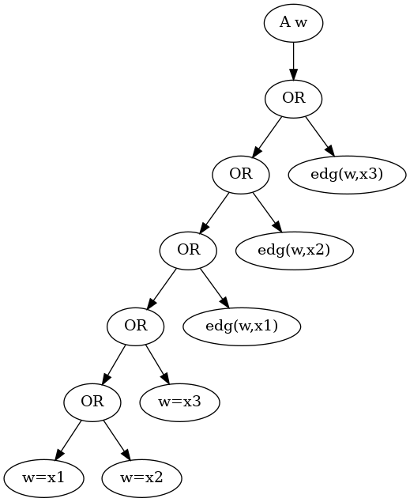

# Pygplib: Python First-Order Graph Property Library

[](https://github.com/toda-lab/pygplib/actions/workflows/test.yml)
[](https://codecov.io/gh/toda-lab/pygplib)

*Pygplib* (Python First-Order Graph Property Library) is a library for 
constructing, manipulating, and encoding graph properties expressible 
with first-order logic of graphs.
Here we mean by *graphs* graphs with no directed edge, no multiple edge, no
isolated edge, no isolated vertex, and no loop.

## Requirements

* [pyparsing 3.0.9](https://github.com/pyparsing/pyparsing)
* [ecc (optional)](https://github.com/Pronte/ECC)
* [pysat 3.0.5 (optional)](https://pysathq.github.io/)
* [pyunigen 2.5.1 (optional)](https://github.com/meelgroup/unigen)

## Examples of Usage

### Parsing First-Order Formula

```python
from pygplib import Fo

f = Fo.read("(! edg(x1,x2)) & (! edg(x1,x3)) & (! edg(x2,x3))")
g = Fo.read("(! x1=x2) & (! x1=x3) & (! x2=x3)")
```

Format of first-order formula will be detailed later.
We can also convert a parsed first-order formula object back to string.

```python
from pygplib import op

assert op.to_str(f) == "(((! edg(x1, x2)) & (! edg(x1, x3))) & (! edg(x2, x3)))"
ff = Fo.read(op.to_str(f))
assert f == ff
```

The resulted string represents substantially the same formula as the one just
read, but a bit different as string.
This is because the precedence of `&` is interpreted as being left associative.
Hence, the following formula `fff`, explicitly specified as being right
associative, is recognized to be a different formula from `f` (and `ff`).

```python
fff = Fo.read("((! edg(x1, x2)) & ((! edg(x1, x3)) & (! edg(x2, x3))))")
assert f != fff
```

Note: it takes much more time to parse the second and the third strings than 
the first one.
Although I am no sure of this reason, nested parentheses seem to increase time
as the parsing time was mitigated by removing the outermost parentheses.

### Name and Index of Symbol

As soon as a formula is parsed, all variable symbols and also constant symbols
appearing in the formula are registered to NameManager class 
(see `pygplib/name.py`) and unique indices are assigned.

```python
from pygplib import NameMgr

v = NameMgr.lookup_index("x1")
name = NameMgr.lookup_name(v)
assert "x1" == name
```

Reset NameManager, if necessary, by `NameMgr.clear()` to delete all
registered names and indices.

```python
from pygplib import NameMgr

NameMgr.clear()
assert not NameMgr.has_index("x1")
v = NameMgr.lookup_index("x1")
assert NameMgr.has_index("x1")
assert NameMgr.has_name(v)
NameMgr.clear()
assert not NameMgr.has_name(v)
assert not NameMgr.has_index("x1")
```

The name of a variable symbol begins with a lowercase letter, 
followed by zero or more lower case letters or digits, 
while the name of a constant symbol begins with an uppercase letter, 
followed by zero or more uppercase letters or digits.

```python
from pygplib import NameMgr

NameMgr.clear()
v = NameMgr.lookup_index("x1")
w = NameMgr.lookup_index("V1")
assert NameMgr.is_variable(v)
assert not NameMgr.is_variable(w)
assert not NameMgr.is_constant(v)
assert NameMgr.is_constant(w)
```

### Constructing First-Order Formula

A new formula can be constructed from existing formulas with operations.

#### Basic Operations

```python
res = Fo.land(f,g)
```

* `Fo.true_const()` returns the true constant `T`.
* `Fo.false_const()` returns the false constant `F`.
* `Fo.neg(f)` returns the negation of `f`.
* `Fo.land(f,g)` returns the AND of `f` and `g`.
* `Fo.lor(f,g)` returns the OR of `f` and `g`.
* `Fo.implies(f,g)` returns the implication from `f` to `g`.
* `Fo.iff(f,g)` returns the equivalence between `f` and `g`.
* `Fo.forall(f,v)` returns the formula `A x f`, where `x=NameMgr.lookup_name(v)`: the formula in which all free occurrences of variable of name `x` are universally quantified.
* `Fo.exists(f,v)` returns the formula `E x f`, where `x=NameMgr.lookup_name(v)`: the formula in which all free occurrences of variable of name `x` are existentially quantified.
* `Fo.eq(v,w)` returns the formula `x=y`, where `x=NameMgr.lookup_name(v)` and `y=NameMgr.lookup_name(w)`.
* `Fo.edg(v,w)` returns the formula `edg(x,y)`, where `x=NameMgr.lookup_name(v)` and `y=NameMgr.lookup_name(w)`.

#### Utility Functions and Advanced Operations

Some utility functions and advanced operations for first-order formulas are listed below (see `pygplib/op.py`).

* `to_str(f)` returns the string representation of formula `f`.
* `print_formula(f, stream=out, fmt=type)` prints out formula in stream (stdout if not given) in human-readable format (fmt="str") or DOT format (fmt="dot").
* `reduce(f)` returns the result reduced from `f` with equivalent transformations to make it be as simple as possible.
* `get_free_vars_and_consts(f)` returns a tuple of the indices of all free variables and constants of `f`.
* `get_free_vars(f)` returns a tuple of the indices of all free variables of `f`.
* `propnize(f)` returns an equivalent propositional formula of first-order formula `f`. **Note: since this method performs quantifier elimination, it would take much time and space if a formula contains quantifiers and a graph is large.**
* `compute_cnf(tup)` performs CNF-encoding for the conjunction of all propositional formulas in the tuple `tup` and returns a tuple of the followings:
    * the maximum index of Boolean variables in the input propositional formulas,
    * the number of auxiliary variables introduced during encoding,
    * a tuple of clauses, each clause is a tuple of variable indices.

```python
from pygplib import Fo
from pygplib import op

f = Fo.read("A w (w=x1 | w=x2 | w=x3 | edg(w,x1) | edg(w,x2) | edg(w,x3))")
with open("data/f.dot","w") as out:
    op.print_formula(f,stream=out,fmt="dot")
```

```shell-session
$ dot -Tpng data/f.dot -o data/f.png
```



The above image shows the data structure of a first-order formula.
The whole formula consists of objects of Fo class with the root node `f`.

### Creating Graph Structure

In order to interpret first-order formula, 
it is necessary to create and set graph structure to Fo class in advance.
A graph structure is an object of GrSt class (see pygplib/grst.py), 
which manages variable domain and the interpretation of relation symbols,
as well as index mapping from first-order variables to propositional variables.

Currently pygplib provides two ways for domain encoding.

#### Vertex-Edge Incidence Matrix

One way is to encode domain with *vertex-edge incidence matrix*.
In the following code block, such a matrix, `ecc`, is computed 
from the graph-file `data/graph.col` in DIMACS graph format, 
which is then converted into domain.
A graph structure object of GrSt class is created and set to Fo class.

```python
from pygplib import GrSt, Fo
from pygplib import util

ecc = util.compute_ecc_edge("data/graph.col")
domain = util.convert_ecc_to_domain(ecc)
Fo.st = GrSt(domain)
```

```shell-session
$ cat data/graph.col
p 5 6
e 1 2
e 1 3
e 2 3
e 3 4
e 3 5
e 4 5
```

The first line means that there are 5 vertices and 6 edges in the graph.
The succeeding lines lists up all edges, one per line.

```
    V1 --- V2          (V1,V2) (V1,V3) (V2,V3) (V3,V4) (V3,V5) (V4,V5)
     \    /        V1     1       1       0       0       0       0
      \  /         V2     1       0       1       0       0       0
       V3          V3     0       1       1       1       1       0
      /  \         V4     0       0       0       1       0       1
     /    \        V5     0       0       0       0       1       1
    V4 --- V5
      Graph                               Matrix
```

The `ecc` is then `((1, 2), (1, 3), (2, 3), (3, 4), (3, 5), (4, 5))`,
which is simply a collection of all edges.
Here, the order of vertices in an edge and the order of edges can be arbitrary, 
but the representation of domain changes according to the order of edges.  

Indeed, the `domain` computed above is 
`((1, 2), (1, 3), (2, 3, 4, 5), (4,6), (5, 6))`, 
which represents a tuple of row vectors of the incidence matrix
above in such a way that `(1,2)` represents the positions of 1s in the V1's row
vector `110000`.  

In this way, each vertex Vi is assigned the code `domain[i-1]`.
With this coding, the equality relation and the adjacency relations between
vertices can be determined through vertex codes, as described below.

* If we assume that a graph has no isolated edge and no isolated vertex, it holds that vertices are different iff their codes are different.
* Moreover, if we assume that a graph has no loop, it holds that vertices are adjacent iff they are different vertices and there is a position at which their codes both have 1.

#### Vertex-Clique Incidence Matrix

The other way of domain encoding is to use *ECC* (*Edge Clique Cover*) 
of a graph.
A collection of cliques is an edge clique cover if each edge of a graph is
included in some clique in the collection.
The collection of edges is trivially an edge clique cover, but the number of
edges can be large.
So it is sometimes effective to compute and use a smaller ECC for domain 
encoding.

The following code block uses the 
[third-party program, ECC8.jar,](https://github.com/Pronte/ECC) 
to compute an ECC.
Please put necessary files and directory at the top directory of this library.

```shell-session
$ ls 
ECC8.jar data/  pygplib/  tmp/ (and other files and directories)
```

**Note: please make sure to remove all files, if any, in `tmp` 
before ECC8.jar runs (because ECC8 seems to recycle files in `tmp`).**

```python
from pygplib import GrSt, Fo
from pygplib import util

util.run_ecc8("data/graph.col", "tmp", "ECC8.jar")
with open("tmp/graph.col-rand.EPSc.cover", "r") as f:
    data = f.read()

ecc = util.parse_ecc(data)
domain1 = util.convert_ecc_to_domain(ecc)
domain2 = util.update_domain_by_edge_addition(ecc, domain1)
Fo.st = GrSt(domain2)
```

The `ecc` is in turn `((3, 1, 2), (5, 3, 4))`, 
which means a collection of `Q1={V1,V2,V3}` and `Q2={V3,V4,V5}`.
The `domain1` is `((1,), (1,), (1, 2), (2,), (2,))`, 
corresponding to Matrix-1 below.
Since different vertices, say V1 and V2, have the same code 10, 
extend the matrix by adding more edges to make different vertices 
have different codes.
The resulted `domain2` is `((1,), (1, 3), (1, 2, 3, 4), (2,), (2, 4))`,
corresponding to Matrix-2 below.

```
    V1 --- V2             Q1      Q2             Q1      Q2   (V2,V3) (V3,V4)
     \    /        V1     1       0      V1      1       0       0       0
      \  /         V2     1       0      V2      1       0       1       0
       V3          V3     1       1      V3      1       1       1       1
      /  \         V4     0       1      V4      0       1       0       0
     /    \        V5     0       1      V5      0       1       0       1
    V4 --- V5
      Graph               Matrix-1                      Matrix-2
```

### Solving First-Order Formula

We are now ready to perform propositional encoding of first-order formula and
compute a vertex-set satisfying the first-order property defined by that
formula.
Let us import necessary modules and create `domain`, from `data/graph.col`, 
as described above, and then proceed to the following code block.  

Note: in order to import `tools.solver`, it is necessary to install 
[PySAT](https://pysathq.github.io/), 
which provides a python interface to SAT solvers.
We can do this without PySAT if we generate an encoded CNF into file in
DIMACS CNF format and run a SAT solver such as 
[Kissat](https://github.com/arminbiere/kissat).
In this case, we need to decode a satisfying assignment computed by SAT solver.
To do this, it would be useful as a reference to see the code of 
`solve_vertexset()`.
See also the CNF-Encoding section for more details.

```python
from tools import solver
Fo.st = GrSt(domain)
f = Fo.read("A w (w=x1 | w=x2 | w=x3 | edg(w,x1) | edg(w,x2) | edg(w,x3))")
solver.solve_vertexset(f)
```

The `solve_vertexset` may return `(('x1', 3), ('x2', 1), ('x3', 1))`, 
which means the assignment `x1=V3`, `x2=V1`, and `x3=V1`.
Here `x2` and `x3` are assigned the same vertex simply because we did not
impose the all-different constraint `(! x1=x2) & (! x1=x3) & (!x2=x3)`.  

We can obtain a dominating set of size 3 by the following code block.
Here, `f` is the formula constructed just above.

```python
g = Fo.read("(! x1=x2) & (! x1=x3) & (! x2=x3)")
solver.solve_vertexset(Fo.land(f,g))
```

### Encoding First-Order Formula

We here describe propositional and CNF encoding of first-order formula 
in more detail.
Before encoding, create `domain` from a graph-file 
(see the Creating Graph Structure section).

The following code block consists of the propositional encoding part and the
CNF encoding part.
We will separately details in the following sections.

```python
from pygplib import Fo, GrSt
from pygplib import op

Fo.st = GrSt(domain)
f = Fo.read("(! edg(x1,x2)) & (! edg(x1,x3)) & (! edg(x2,x3))")
g = op.propnize(f)

tup  = op.compute_domain_constraint(f)
with open("data/t1.dot","w") as out:
    op.print_formula(tup[0],stream=out,fmt="dot")

base, naux, cnf = op.compute_cnf( (g, ) + tup )
```

#### Propositional Encoding

We will describe why we consider not only `g` but also `tup` in the above code
block.
Remember that a first-order variable runs over vertices (valid binary codes),
in other words, a variable never runs over codes outside `domain`.
To impose this (called *domain constraints*) on first-order variables, 
we added `tup` in the above code block.

```shell-session
$ dot -Tpng data/t1.dot -o data/t1.png
```


The above image depicts the domain constraint for `x3`.
The `tup` consists of the constraints for `x1`, `x2`, and `x3`.
Clearly, for a large graph, these constraints can be a computational
bottleneck, which remains to be improved.

In summary, the propositional formula encoded from `f` is 
the conjunction of `g`, `tup[0],` `tup[1]`, and `tup[2]`.

#### CNF Encoding

```python
base, naux, cnf = op.compute_cnf( (g, ) + tup )
```

The CNF encoding part above is done by applying Tseitin transformation to the
propositional formula `h:=(g, ) + tup`.
No equisatisfiable transformation is used, and hence there is a one-to-one
correspondence between satisfying assignments of CNF variables and those of
first-order variables, 
for the purpose of solution enumeration, counting and sampling.

The `base` is the maximum index of a propositional variable appearing in `h`.
The indices of propositional variables in `h` are reused in CNF, and hence
CNF variables with indices less than or equal to `base` are variables in `h`.

On the other hand, CNF variables with indices larger than `base` are auxiliary
variables introduced during CNF encoding.
In order to decode a satisfying assignment of CNF variables, `assign`, 
to that of first-order variables `decoded_assign`, 
we can safely ignore auxiliary variables and it is sufficient to do as follows.

```python
assign = [lit for lit in assign if abs(lit) <= base]

res = Fo.st.get_interpretation_of_assign(assign)
decoded_assign = tuple([(NameMgr.lookup_name(key), res[key]+1) \
                            for key in sorted(res.keys())])
```

If we prefer to encode propositional variables so that there is no missing
index from 1 to `base`, we can use Cnf class (`pygplib/cnf.py`).
This becomes necessary for the purpose of solution enumeration, counting and
sampling.

## Format of First-Order Formula

The following notation is useful shorthand.

* `e1 | e2 | e3 |` ... means a choice of `e1`, `e2`, `e3`, etc.
* `( e )*` means zero or more occurrences of `e`.
* `["a"-"z"]` matches any lowercase alphabet letter.
* `["A"-"Z"]` matches any uppercase alphabet letter.
* `["0"-"9"]` matches any digit from `"0"` to `"9"`.
* `<word>` means a non-terminal symbol.

The name of a *variable symbol* is defined as follows.

```
    <var_symb>::= <alpha_lower> (<alpha_lower> | <digit> | "_")*
    <alpha_lower>::= ["a"-"z"]
    <digit>::= ["0"-"9"]
```

The name of a *constant symbol* is defined as follows.

```
    <con_symb>::= <alpha_upper> (<alpha_upper> | <digit> | "_")*
    <alpha_upper>::= ["A"-"Z"]
    <digit>::= ["0"-"9"]
```

An *atomic formula* is defined as follows.

```
    <atom>::= <edg_atom> | <eq_atom> | <con_atom>
    <edg_atom>::= "edg" "(" <term> "," <term> ")"
    <eq_atom>::=  <term> "=" <term>
    <con_atom>::= "T" | "F"
    <term>::= <var_symb> | <con_symb>
```

A *first-order formula* is defined as follows.

```
    <expr>::= <atom> | "(" <unop> <expr> ")" | "(" <expr> <binop> <expr> ")" | "(" <qf> <var> <expr> ")"
    <unop>::= "!"
    <binop>::= "&" | "|" | "->" | "<->"
    <qf>::= "A" | "E"
```

Parenthesis can be omitted as long as the interpretation is uniquely 
determined.
The precedence of logical operators is determined as follows.

```
    "A"="E" > "!" > "&" > "|" > "->" > "<->"
```

Operators of the same precedence are associated in such a way that 
binary operations are left-associative, unary operation and quantifiers 
are right-associative.

Note: `! A x T` means `! (A x T)`.
However, `A x ! T` cannot be parsed because the parser attempts 
to interpret it as `(A x !) T` due to precedence, unless I misunderstand.

## Applications

### Uniform-Sampling of First-Order Expressible Vertex-Sets

```python
from pygplib import GrSt, Fo
from pygplib import util
from tools import solver

ecc = util.compute_ecc_edge("data/graph.col")
domain = util.convert_ecc_to_domain(ecc)
Fo.st = GrSt(domain)
f = Fo.read("A w (w=x1 | w=x2 | w=x3 | edg(w,x1) | edg(w,x2) | edg(w,x3))")
solver.sample_vertexset(f, num=5)
```

Note: in order to use `sample_vertexset()`, it is necessary to 
install [pyunigen](https://github.com/meelgroup/unigen).

### Reconfiguration Problems of First-Order Property of Graph Vertices

`examples/recon.py` computes reconfiguration problems of vertex sets 
expressible with first-order formulas.
A set of first-order formulas by which a reconfiguration problem instance is
defined is supposed to be given in formula-file.

```shell-session
$ python examples/recon.py -t TJ -d tmp -e "edge" data/sample.col data/sample1.phi
c SATISFIABLE
a 3 4 5
a 1 4 5
a 1 4 6
a 1 7 6
a 2 7 6
c compile_time  0.1260545253753662
c solve_time    0.001790761947631836
c whole_time    0.46629762649536133
```

```shell-session
$ cat data/sample1.phi
s (! x1=x2 & ! edg(x1,x2)) & (! x1=x3 & ! edg(x1,x3)) & (! x2=x3 & ! edg(x2,x3))
i x1=V3 & x2=V4 & x3=V5
f x1=V2 & x2=V7 & x3=V6
```

The lines starting with `s`, `i`, and `f` specify a property each state must
satisfy, a property of the initial state, and a property of the final state,
respectively.
In stead of specifying transition relation between states in formula-file, 
we specified `-t TJ` in the command line, which means Token Jumping.

Note that initial/final state property is not equality relation as set.
Indeed, the assignment x1=V7, x2=V2, x3=V6 for the final state is not
satisfying.
To avoid this, the following is a useful notation to indicate set equality
relation.

```shell-session
$ cat data/sample4.phi
s (! x1=x2 & ! edg(x1,x2)) & (! x1=x3 & ! edg(x1,x3)) & (! x2=x3 & ! edg(x2,x3))
i 3 4 5
f 2 7 6
```

The final state constraint `f 2 7 6` is equivalent to the following formula.

```
(x1=V2 | x1=V7 | x1=V6) & (x2=V2 | x2=V7 | x2=V6) & 
(x3=V2 | x3=V7 | x3=V6) & (x1=V2 | x2=V2 | x3=V2) & 
(x1=V7 | x2=V7 | x3=V7) & (x1=V6 | x2=V6 | x3=V6)
```

```
usage: recon.py [-h] [-b BOUND] [-t TRANS] [-d TMPDIR] [-e ECC] arg1 arg2

positional arguments:
  arg1                  dimacs graph file
  arg2                  formula file

optional arguments:
  -h, --help            show this help message and exit
  -b BOUND, --bound BOUND
                        Specify maximum bound
  -t TRANS, --trans TRANS
                        Specify transition relation (TS or TJ)
  -d TMPDIR, --tmpdir TMPDIR
                        Specify temporary directory
  -e ECC, --ecc ECC     Specify ECC type (edge or clique)
```

## Citation
TBD

## Author
Takahisa Toda  
Graduate School of Informatics and Engineering, 
The University of Electro-Communications  
1-5-1 Chofugaoka, Chofu, Tokyo 182-8585, Japan  
[http://www.disc.lab.uec.ac.jp/toda/index-en.htm](http://www.disc.lab.uec.ac.jp/toda/index-en.html)  
