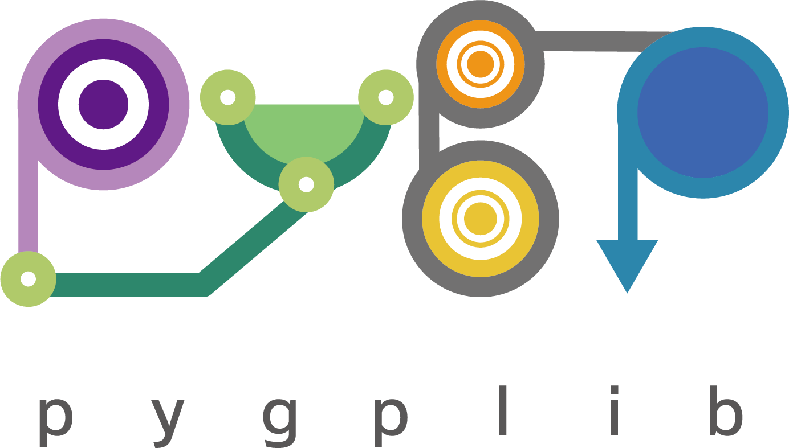

|PyPI Version| |Python Versions| |Test| |Coverage| |License| |Documentation|

Python First-Order Graph Property Library
==================================================

``Pygplib`` (Python First-Order Graph Property Library) is a Python module 
for constructing, manipulating, and encoding graph properties expressible 
with first-order logic of graphs.
It serves as a prototyping tool to tackle with 
various graph related applications.
It provides access to state-of-the-art satisfiability technologies 
without advanced knowledge.
Basic steps to follow are :

- Express a graph property of interest as a first-order formula.
- Set a graph structure, and encode a first-order formula into CNF, 
  a canonical normal form for propositional formulas.
- Apply satisfiability tools to the CNF to compute satisfying
  assignments.
- Decode the result into an assignment of first-order variables.

Documentation
=============

For installation, examples, tutorials, and so on, please see `online documentation <https://pygplib.readthedocs.io/en/latest/>`__ .

Citation
========

Please cite the following paper if you use ``pygplib``:

::

  @INPROCEEDINGS {10356599,
  author = {T. Toda and T. Ito and J. Kawahara and T. Soh and A. Suzuki and J. Teruyama},
  booktitle = {2023 IEEE 35th International Conference on Tools with Artificial Intelligence (ICTAI)},
  title = {Solving Reconfiguration Problems of First-Order Expressible Properties of Graph Vertices with Boolean Satisfiability},
  year = {2023},
  volume = {},
  issn = {},
  pages = {294-302},
  abstract = {This paper presents a unified framework for capturing a variety of graph reconfiguration problems in terms of firstorder expressible properties and proposes a Boolean encoding for formulas in the first-order logic of graphs based on the exploitation of fundamental properties of graphs. We show that a variety of graph reconfiguration problems captured in our framework can be computed in a unified way by combining our encoding and Boolean satisfiability solver in a bounded model checking approach but allowing us to use quantifiers and predicates on vertices to express reconfiguration properties.},
  keywords = {automata;model checking;encoding;artificial intelligence},
  doi = {10.1109/ICTAI59109.2023.00050},
  url = {https://doi.ieeecomputersociety.org/10.1109/ICTAI59109.2023.00050},
  publisher = {IEEE Computer Society},
  address = {Los Alamitos, CA, USA},
  month = {nov}
  }

Bugs/Requests/Discussions
=========================

Please report bugs and requests from `GitHub Issues
<https://github.com/toda-lab/pygplib/issues>`__ , and 
ask questions from `GitHub Discussions <https://github.com/toda-lab/pygplib/discussions>`__ .

History
=======
Please see `CHANGES <https://github.com/toda-lab/pygplib/blob/main/CHANGES.rst>`__ .

License
=======

Please see `LICENSE <https://github.com/toda-lab/pygplib/blob/main/LICENSE>`__ .

.. |Test| image:: https://github.com/toda-lab/pygplib/actions/workflows/test.yml/badge.svg
   :target: https://github.com/toda-lab/pygplib/actions/workflows/test.yml

.. |Coverage| image:: https://codecov.io/gh/toda-lab/pygplib/graph/badge.svg?token=WWR54JE3M1
   :target: https://codecov.io/gh/toda-lab/pygplib

.. |Python Versions| image:: https://img.shields.io/pypi/pyversions/pygplib
   :target: https://pypi.org/project/pygplib/
   :alt: PyPI - Python Versions

.. |PyPI Version| image:: https://img.shields.io/pypi/v/pygplib
   :target: https://pypi.org/project/pygplib/
   :alt: PyPI - Version

.. |License| image:: https://img.shields.io/badge/License-MIT-yellow.svg
    :target: https://opensource.org/licenses/MIT
    :alt: License

.. |Documentation| image:: https://readthedocs.org/projects/pygplib/badge/?version=latest
    :target: https://pygplib.readthedocs.io/en/latest/?badge=latest
    :alt: Documentation Status
