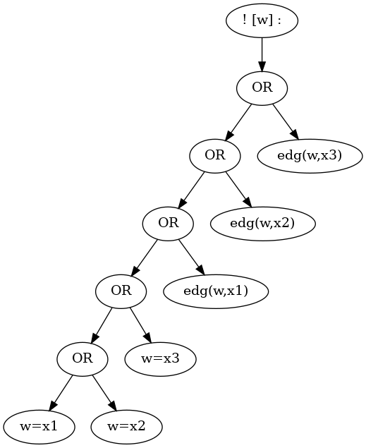
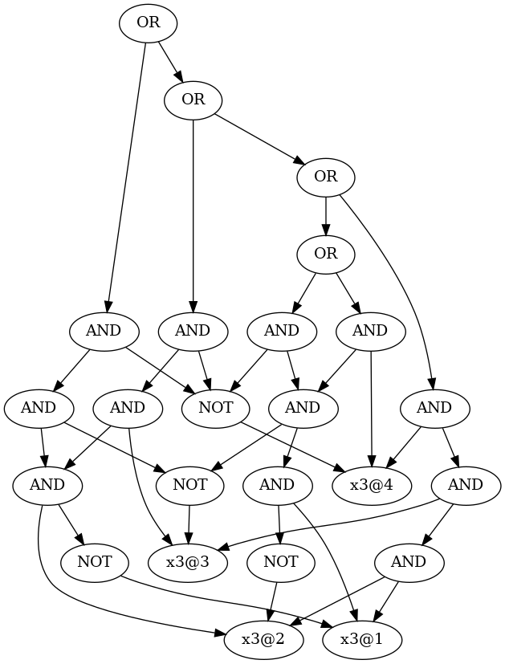

How to Use Pygplib Module
==========================

This document provides how-to instructions for a Python library 
for constructing, manipulating, and encoding graph properties expressible 
with first-order logic of graphs. We mean by *graphs* graphs 
with no directed edge, no multiple edge, no isolated edge, 
at most one isolated vertex, and no loop.
See :ref:`FirstOrderLogicofGraphs`.

Parsing First-Order Formula
---------------------------

The ``pygplib`` mostly supports the format of untyped first-order formulas in
the `TPTP
format <https://www.tptp.org/Seminars/TPTPWorldTutorial/LogicFOF.html>`__
for automated theorem proving.
The format is detailed in :ref:`FormatofFirstOrderFormula`.
The expression of a first-order formula can be parsed and 
constructed to a formula object by ``Fog.read()``.

.. code:: python

   from pygplib import Fog

   f = Fog.read("(~ edg(x1,x2)) & (~ edg(x1,x3)) & (~ edg(x2,x3))")

A formula object can be converted back to string by ``op.to_str()``.

.. code:: python

   from pygplib import op

   assert op.to_str(f) == "(((~ edg(x1, x2)) & (~ edg(x1, x3))) & (~ edg(x2, x3)))"
   ff = Fog.read(op.to_str(f))
   assert f == ff

Clearly the resulted string is logically equivalent to the one just read, and 
the assertion holds in this case, however it should be noted that
a formula object simply represents its syntax
and ``f == ff`` does not mean asserting the logical equivalence.
The above assertion holds simply because the precedence of ``&`` is 
interpreted as being left associative. 
Hence, the following formula ``fff``, explicitly specified
as being right associative, is determined to be a different formula from
``f`` (and ``ff``).

.. code:: python

   fff = Fog.read("((~ edg(x1, x2)) & ((~ edg(x1, x3)) & (~ edg(x2, x3))))")
   assert f != fff

Note: when the class variable ``partitioning_order`` of ``Prop`` class and that
of ``Fog`` class are set ``True``, binary operations for objects of these classes 
with equal priority are associated in such a way that objects are recursively
partitioned into the left and the right halves.

.. code:: python

    Fog.partitioning_order = False
    f = Fog.read("T & T & T & T")
    assert op.to_str(f) == "(((T & T) & T) & T)"
    Fog.partitioning_order = True
    f = Fog.read("T & T & T & T")
    assert op.to_str(f) == "((T & T) & (T & T))"
    Fog.partitioning_order = False

Name and Index of Symbol
^^^^^^^^^^^^^^^^^^^^^^^^

As soon as an expression is parsed, all variable symbols as well as constant
symbols appearing in the formula will be registered to NameManager class 
and unique indices are assigned.

.. code:: python

   from pygplib import NameMgr

   v = NameMgr.lookup_index("x1")
   name = NameMgr.lookup_name(v)
   assert "x1" == name

Reset NameManager, if necessary, by ``NameMgr.clear()``, which deletes all
registered names and indices.

.. code:: python

   NameMgr.clear()
   assert not NameMgr.has_index("x1")
   v = NameMgr.lookup_index("x1") # new index is issued for the first time.
   assert NameMgr.has_index("x1")
   assert NameMgr.has_name(v)
   NameMgr.clear()
   assert not NameMgr.has_name(v)
   assert not NameMgr.has_index("x1")

The name of a variable symbol should begin with a lowercase letter,
followed by zero or more lower case letters, digits, or underscore,
while the name of a constant symbol should begin with an uppercase
letter, followed by zero or more uppercase letters, digits, or
underscore.

.. code:: python

   NameMgr.clear()
   v = NameMgr.lookup_index("x1")
   w = NameMgr.lookup_index("V1")
   assert NameMgr.is_variable(v)
   assert NameMgr.is_constant(w)

Constructing First-Order Formula
--------------------------------

An arbitrary well-formed formula can be constructed with built-in operators.

Basic Operators
^^^^^^^^^^^^^^^

.. code:: python

   v = NameMgr.lookup_index("x")
   w = NameMgr.lookup_index("y")
   f = Fog.edg(v,w)
   assert op.to_str(f) == "edg(x, y)"

   g = Fog.neg(Fog.eq(v,w))
   assert op.to_str(g) == "(~ x = y)"

   h = Fog.implies(f,g)
   assert op.to_str(h) == "(edg(x, y) -> (~ x = y))"

-  ``Fog.true_const()`` returns the true constant, ``T``.
-  ``Fog.false_const()`` returns the false constant ``F``.
-  ``Fog.neg(f)`` returns the negation of ``f``.
-  ``Fog.land(f,g)`` returns the AND of ``f`` and ``g``.
-  ``Fog.lor(f,g)`` returns the OR of ``f`` and ``g``.
-  ``Fog.implies(f,g)`` returns the implication from ``f`` to ``g``.
-  ``Fog.iff(f,g)`` returns the equivalence between ``f`` and ``g``.
-  ``Fog.forall(f,v)`` returns the formula in which all free occurrences
   of the name of ``v`` are universally quantified.
-  ``Fog.exists(f,v)`` returns the formula in which all free occurrences
   of the name of ``v`` are existentially quantified.
-  ``Fog.eq(v,w)`` returns the formula written as ``x=y`` in string,
   where ``x`` and ``y`` are the names of ``v`` and ``w``.
-  ``Fog.edg(v,w)`` returns the formula written as ``edg(x,y)`` in string, 
   where ``x`` and ``y`` are the names of ``v`` and ``w``.

Utility Functions and Advanced Operations
^^^^^^^^^^^^^^^^^^^^^^^^^^^^^^^^^^^^^^^^^

Some utility functions and advanced operations are listed.

-  ``to_str(f)`` returns the string representation of formula object ``f``.
-  ``print_formula(f, stream=out, fmt=type)`` prints out formula object in
   stream (stdout if not given) in human-readable format (fmt=“str”) or
   DOT format (fmt=“dot”).
-  ``reduce_formula(f)`` returns the reduced result obtained from ``f`` 
   by applying equivalent transformations.
-  ``get_free_vars(f)`` returns a tuple of the indices of all free
   variables of ``f``.
-  ``get_free_vars_and_consts(f)`` returns a tuple of 
   not only the indices of free variables but also the indices of constants.
-  ``perform_boolean_encoding(f, st)`` returns a propositional 
   formula that is equivalent to first-order formula ``f`` in graph structure
   ``st``. 
   **Note: since this method performs quantifier elimination, 
   it would take much time and space if a
   formula contains quantifiers and a graph is large.**

The formula written as ``edg(x, x)`` is unsatisfiable as we assume that a graph has no loop.
The formula is evaluated to false by ``op.reduce_formula()`` just like
``eval()`` does in arithmetic expression.

.. code:: python

   f = Fog.read("edg(x, x)")
   assert f != Fog.false_const() 
   assert op.reduce_formula(f) == Fog.false_const()

However, ``op.reduce_formula()`` only performs a few equivalent transformations 
and the resulted formula not always becomes irreducible, as demonstrated 
in the following code block.

.. code:: python

   f = Fog.read("edg(x, y) -> (~ x = y)")
   for v in op.get_free_vars(f):
       f = Fog.forall(f,v)

   assert op.to_str(f) == "(! [y] : (! [x] : (edg(x, y) -> (~ x = y))))"
   assert op.reduce_formula(f) != Fog.true_const()  
   # f is logically equivalent to true, but it is not reduced upto true.

A formula can be printed out in DOT format, allowing us to visualize.

.. code:: python

   from pygplib import Fog
   from pygplib import op

   f = Fog.read("! [w] : (w=x1 | w=x2 | w=x3 | edg(w,x1) | edg(w,x2) | edg(w,x3))")
   with open("f.dot","w") as out:
       op.print_formula(f,stream=out,fmt="dot")

.. code:: shell-session

   $ dot -Tpng f.dot -o f.png

The above image depicts the data structure of a first-order formula. The
whole formula consists of objects of ``Fog`` class with the root node ``f``.

Creating Graph Structure
------------------------

In order to encode a first-order formula, it is necessary to create a 
graph structure. A graph structure is an
object of ``GrSt`` class, which manages domain of discourse as well as
the interpretation of relation symbols over it.
Moreover ``GrSt`` class manages the encoding and decoding 
between first-order variables and CNF variables.

Currently there are different ways for the initialization of ``GrSt`` objects,
depending on the types of domain encoding: *edge encoding*, 
*clique encoding*, *direct encoding*, and *log encoding*.

The first example is edge-encoding.
As commented, each vertex is assigned 
a binary code (a row vector) of the matrix, which is a vertex-edge 
incidence matrix.

.. code:: python

   from pygplib from GrSt
   from pygplib from NameMgr
   # V1 --- V2
   #  \    /
   #   \  /
   #    V3
   #   / \
   #  /   \
   # V4---V5
   vertex_list = [1,2,3,4,5]
   edge_list = [(1,2),(1,3),(2,3),(3,4),(3,5),(4,5)]
   #
   # V1 |1 1 0 0 0 0|
   # V2 |1 0 1 0 0 0|
   # V3 |0 1 1 1 1 0|
   # V4 |0 0 0 1 0 1|
   # V5 |0 0 0 0 1 1|
   st = GrSt(vertex_list, edge_list, encoding="edge", prefix="V")
   assert NameMgr.lookup_name(st.vertex_to_object(vertex_list[1])) == "V2"

As above, ``vertex_to_object()`` converts a vertex into a constant symbol
index. When a graph structure is initialized, the constant symbols for all vertices are 
registered to ``NameMgr`` so that the name of a constant symbol begins with a given prefix, 
followed by a vertex index.
If a prefix is not given, default prefix is ``V``.

The second example is clique-encoding.
The following matrix is a vertex-clique incidence matrix, where
the collection of cliques, designated by column vectors, is
a *separating edge clique cover*.
In general, clique-encoding has size less than or equal 
to the edge-encoding.
The program for computing a separating edge clique cover is developed by the
author of ``pygplib``, but it is based on 
`heuristic algorithms by Conte et al <https://doi.org/10.1016/j.ic.2019.104464>`__ . 
Although the program `ECC8 <https://github.com/Pronte/ECC>`__ developed in Java 
by Conte is publicly available, it is not used in ``pygplib`` to make it
self-contained and pure-Python module.

.. code:: python

   #
   # V1 |1 0 1 0|
   # V2 |1 0 0 0|
   # V3 |1 1 1 1|
   # V4 |0 1 0 0|
   # V5 |0 1 0 1|
   st = GrSt(vertex_list, edge_list, encoding="clique", prefix="V")

The third example is direct-encoding (or one-hot encoding).
Given the following structure, a first-order variables is assigned vertex, 
say ``V2``, if and only if it has the code of high value at the
corresponding bit ``01000``.

.. code:: python

   # 
   # V1 |1 0 0 0 0|
   # V2 |0 1 0 0 0|
   # V3 |0 0 1 0 0|
   # V4 |0 0 0 1 0|
   # V5 |0 0 0 0 1|
   st = GrSt(vertex_list, edge_list, encoding="direct", prefix="V")

The forth example is log-encoding.
Each vertex is assigned with the binary representation of its index. 

.. code:: python

   # 
   # V1 |0 0 0|
   # V2 |1 0 0|
   # V3 |0 1 0|
   # V4 |1 1 0|
   # V5 |0 0 1|
   st = GrSt(vertex_list, edge_list, encoding="log", prefix="V")

Note: Interpretation of Atoms
-----------------------------

The following formulas are evaluated to true regardless of terms 
``x``, ``y``, and graph structures.

- ``~ edg(x, x)``
- ``edg(x, y) -> edg(y, x)``
- ``x = x``
- ``x = y -> y = x``
- ``x = y  & y = z -> x = z``

.. _EncodingFirstOrderFormula:

Encoding First-Order Formula
----------------------------

Let us now describe how first-order formulas can be encoded into CNFs.

In the following code block, a graph structure is created.
A first-order formula is parsed and constructed.
It is then converted to a list of propositional formulas 
``Prop`` ``[g, ] + li``,  with which ``Cnf`` object ``mgr`` is created.

.. code:: python

    from pygplib import Fog, op, GrSt, Cnf, Prop

    vertex_list = [1,2,3,4,5]
    edge_list = [(1,2),(1,3),(2,3),(3,4),(3,5),(4,5)]
    st = GrSt(vertex_list, edge_list, encoding="clique", prefix="V")

    f = Fog.read("(~ edg(x1,x2)) & (~ edg(x1,x3)) & (~ edg(x2,x3))")

    g = op.perform_boolean_encoding(f, st)
    li  = [st.compute_domain_constraint(v) \
                    for v in op.get_free_vars(f)]

    mgr = Cnf( [g, ] + li , st=st)
    # If the 2nd argument is given, the extra information of
    # encoding will be added to the header of DIMACS CNF file.

We will describe this code block in more details in the following sections
in terms of the Boolean encoding part (the computation of
``g`` and ``li``) and the CNF encoding part.

Boolean Encoding
^^^^^^^^^^^^^^^^

We will describe why we consider not only ``g`` but also ``li`` in the
previous code block. Remember that a first-order variable runs over
vertices (valid binary codes), in other words, a variable never runs
outside domain. To impose this (called *domain
constraints*) on first-order variables, we need to add ``li``, a list of
propositional formula objects, one for each first-order variable.

Let us visualize a domain constraint for a better understanding.

.. code:: python

    with open("t1.dot","w") as out:
        op.print_formula(li[0],stream=out,fmt="dot")

.. code:: shell-session

   $ dot -Tpng t1.dot -o t1.png

The above image depicts the domain constraint for ``x3`` in clique-encoding, 
where ``x3@1``, ``x3@2``, ``x3@3``, and ``x3@4`` represents propositional variables 
representing the binary code of ``x3``.
The ``li`` consists of the constraints for ``x1``, ``x2``, and ``x3``, while
``g`` represents the propositional formula for ``f`` but excluding domain constraints.

In summary, the propositional formula encoded from ``f`` amounts to the
conjunction of ``g``, ``li[0],`` ``li[1]``, and ``li[2]``.

Note that domain constraints in one encoding are logically equivalent but
different as formulas from those in another encoding.
The same applies to the propositional formulas encoded from atomic first-order formulas.

CNF Encoding
^^^^^^^^^^^^

When a ``Cnf`` object is initialized, 
the list of propositional formulas given as input is converted to CNF.
A ``Cnf`` object is able to generate CNF in DIMACS CNF format.
It should be noted that 
the indices of CNF variables in the output are changed so that there is no
missing index.
A ``Cnf`` object manages the index mapping between 
*internal* CNF variables (those in propositional formulas in ``[g, ] + li``)
and *external* CNF variables (those in the output DIMACS CNF).

A ``Cnf`` object provides the following instance methods.

- ``get_nvars()``: returns the number of CNF variables (in other words, the
  maximum index of an external CNF variable)
- ``get_ncls()``: returns the number of clauses
- ``get_clause(i)``: returns the ``i``-th clause, a tuple of nonzero-integers
  (indices of external CNF variables),
  where ``i`` ranges from ``0`` to the number of clauses minus ``1``.
-  ``write(stream=stdout)``: generates a CNF in DIMACS format to stream (``stdout`` if not given).
- ``decode_assignment(assign)``: decodes the assignment of DIMACS CNF
  variables (external CNF variables), ``assign``, to the assignment of internal CNF variables.

The easiest way to solve CNF would be to use 
``pysat``, `a toolkit for SAT-based prototyping in Python <https://pysathq.github.io/>`__ .
The ``pygplib`` in itself does not provide any functionality of 
solving formulas, and is independent of ``pysat`` module.
Please see :ref:`ExampleofUsage`.

In the following code block, the CNF manager ``mgr`` generates a CNF to a file in 
DIMACS CNF format, which provides an alternative way to solve formulas with external solvers that conforms to 
`the DIMACS CNF requirements <http://www.satcompetition.org/2009/format-benchmarks2009.html>`__ .

.. code:: python

    with open("f.cnf","w") as out:
        mgr.write(stream=out)

If an external solver is used, the comment lines of a DIMACS CNF file might be
useful to decode a satisfying assignment.

.. code:: shell-session

    $ cat f.cnf
    (The first part omitted)
    c dom V1: 2 4
    c dom V2: 2
    c dom V3: 1 2 3 4
    c dom V4: 1 3
    c dom V5: 1
    c enc 2 x1@1
    c enc 4 x2@1
    c enc 7 x1@2
    c enc 9 x2@2
    c enc 13 x1@3
    c enc 15 x2@3
    c enc 19 x1@4
    (The remaining part omitted)

Each line beginning with ``c dom`` shows the code of each vertex, and
each line beginning with ``c enc`` shows the mapping between external CNF
variable indices and internal CNF variable names:
``c enc <dimacs_cnf_variable_index> <name_of_first_order_variable>@<bit>``
, where the name of an internal CNF variable is the concatenation of the
corresponding first-order variable and bit position.
For instance, the above header means that a first-order variable, say ``x1``,
is encoded in such a way that the first-bit ``x1@1`` is represented by 
DIMACS CNF variable ``2``, the second bit ``x1@2`` by ``4``, and so on;
The assignment ``x1@1=0``, ``x1@2=1``, ``x1@3=0``, and ``x1@4=1`` means that
``x1`` is assigned vertex ``V1`` (because the code of ``V1`` is ``(2,4)``).

The CNF computation is done by Tseitin transformation. 
There is a one-to-one correspondence between satisfying assignments 
of CNF variables and those of first-order variables.
